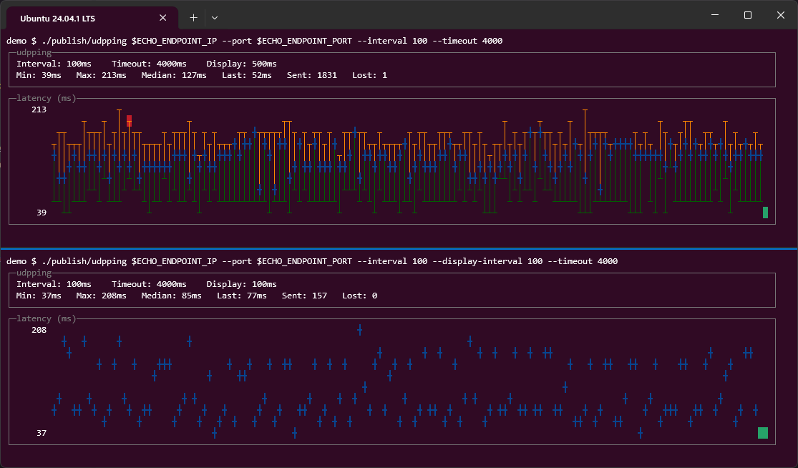

# udpping

A `gping`-style latency grapher that probes over plain UDP echo (RFC 862)
instead of ICMP.



## How it works

- Every `--interval` ms, a packet containing a fresh GUID (16 bytes) is
  sent to `<host>:<port>`.
- When a reply arrives, its 16-byte payload is matched back to the GUID
  that was sent, and the elapsed time is the round-trip time.
- A packet with no reply within `--timeout` ms counts as dropped.
- Time is divided into `--display-interval` ms **ticks**. Every packet belongs to the tick
  it was **sent** in (not the tick its reply lands in), so a tick's
  column keeps updating with new data even after later ticks have
  already appeared on screen - a late reply, or a drop, can still land
  a mark on a column that's scrolled a few positions to the left.

> **Note:** the target must actually run a UDP echo service that sends
> back exactly what it received. Most servers on the internet do not run
> this; you'll typically point this at your own echo listener (many
> simple ones exist in a few lines of Python/Go/etc.), or a router/appliance
> that offers RFC 862 echo.

## Install

### Linux (snap or direct download)

```
snap install udpping
```

Or download the self-contained native binary for your architecture
(`linux-x64` / `linux-arm` / `linux-arm64`) from the
[releases page](https://github.com/mlhpdx/udpping/releases), unzip it,
and mark it executable (`chmod +x udpping`). The direct-download binaries
are Native AOT builds and need no .NET runtime.

### .NET global tool (Linux x64/arm/arm64, Windows)

Requires the [.NET runtime](https://dotnet.microsoft.com/download) (10.0+)
to be installed. One package works on every supported platform:

```
dotnet tool install --global udpping
```

Update to the latest release with `dotnet tool update --global udpping`,
and remove it with `dotnet tool uninstall --global udpping`.

### Windows (winget or MSI)

```
winget install mlhpdx.udpping
```

Or download the `.msi` for your architecture (`win-x64` / `win-arm64`)
from the [releases page](https://github.com/mlhpdx/udpping/releases).

## Usage

```
udpping <host> [options]

  -p, --port <n>               UDP port of the echo service (default: 7)
  -i, --interval <ms>          Time between probes, in milliseconds (default: 200)
  -d, --display-interval <ms>  Time period for which sends are grouped in display (default: 500)
  -t, --timeout <ms>           Time to wait for a reply before it's a drop (default: 2000)
  -h, --help                   Show help
```

Example:

```
udpping echo.example.com -p 7 -i 200 -t 2000
```

## Reading the graph

Each column is one 500ms tick. Within a column:

| Symbol | Meaning |
|---|---|
| `┬` | max RTT this tick |
| `╋` | median RTT this tick, **or** two/three of max/min/median landed on the same row |
| `┴` | min RTT this tick |
| red background (on the max cell) | at least one packet sent in this tick timed out |
| green background (on the max cell) | no timeouts yet, but at least one packet sent in this tick is still in flight |
| default background | every packet sent in this tick has resolved, none timed out |

If a tick has no completed replies yet but does have drops or in-flight
packets, a colored blank cell is shown at the bottom row as a placeholder
until real data arrives.

The two numbers along the left edge are the current y-axis scale (top =
current max, bottom = current min. The graph is auto-scaled on each tick
to whatever is visible).

The panel above the graph shows the target/interval/timeout, and the
min/max/median/last RTT and sent/lost counters across everything
currently visible in the graph.

## Design

This implementation uses:

- A fixed **10-row** graph height (auto-scaled between the min and max
  RTT currently visible), with a small left-hand column for the two
  scale labels.
- A **status panel** above the graph (target/interval/timeout on one
  line, min/max/median/last/sent/lost on the next) rather than folding
  status text into the graph's top rows.
- The graph's column count grows to fill the console width (minus the
  label column and panel borders); there's no hard cap.

## Build & run

Requires the .NET 10 SDK.

```
dotnet run -- echo.example.com -p 7
```

## Publish as a self-contained Native AOT binary

```
dotnet publish -c Release -r <RID> -o ./publish
```

Replace `<RID>` with your target runtime identifier, e.g. `win-x64`,
`linux-x64`, `linux-arm64`, or `osx-arm64`. The result is a single
native executable (`udpping` / `udpping.exe`) in `./publish` with no
.NET runtime dependency.

## Code layout

- `Program.cs` - argument parsing entry point, host resolution, and the
  Spectre.Console `Live` render loop (ticking every `--display-interval`ms).
- `CliOptions.cs` - CLI parsing (kept dependency-free for AOT `publish`).
- `PingEngine.cs` - the send loop (steady cadence), the receive loop 
  (matches replies by GUID), and the timeout sweep.
- `TickData.cs` / `Cell.cs` - small data types for per-tick stats and
  graph cells.
- `GraphRenderer.cs` - turns engine state into the Spectre.Console
  status panel + graph panel.